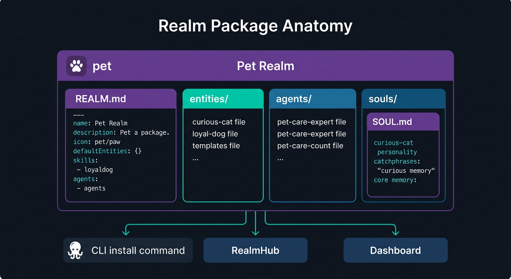
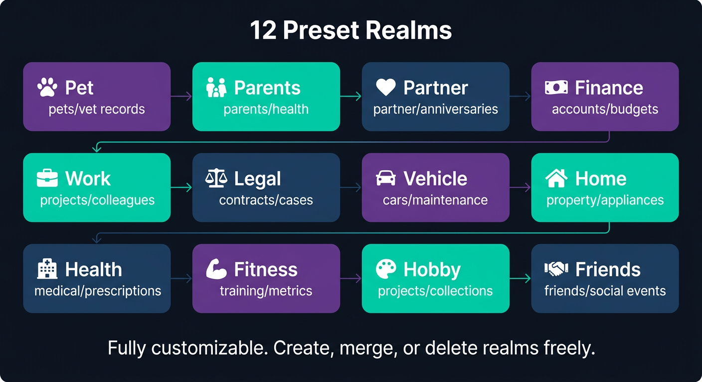

<p align="center">
  <picture>
    <source media="(prefers-color-scheme: light)" srcset="https://raw.githubusercontent.com/open-octopus/openoctopus.club/main/src/assets/brand/logo-dark.png">
    
  </picture>
</p>

<h3 align="center">realms</h3>

<p align="center">
  Official realm packages archive — REALM.md definitions, SOUL.md personalities, agents, and skills for every life domain.
</p>

<p align="center">
  <a href="https://github.com/open-octopus/realms/blob/main/LICENSE"></a>
  <a href="#"></a>
  <a href="https://github.com/open-octopus/openoctopus"></a>
  <a href="https://discord.gg/mwNTk8g5fV"></a>
</p>

---

> **Status: Planned** — Phase 1 focuses on **pet** and **parents** realms as the vertical slice for the AI family home hub. Other realms will be activated progressively.

## What is realms?

**realms** is the official archive of realm packages for [OpenOctopus](https://github.com/open-octopus/openoctopus). Each realm package is a complete life domain solution — containing a `REALM.md` definition, entity templates, agent configurations, SOUL.md personalities, and skills.

Think of it as the "standard library" of life domains: install a realm and you get a fully configured domain with agents ready to assist you.

## REALM.md Format Specification

<p align="center">
  
</p>

A REALM.md file uses YAML front matter to define a life domain. The body contains Markdown documentation for the realm.

### Schema

| Field | Type | Required | Description |
|-------|------|----------|-------------|
| `name` | `string` | **Yes** | Realm identifier (e.g., `pet`, `finance`) |
| `description` | `string` | **Yes** | What this realm manages |
| `icon` | `string` | No | Emoji icon for the realm |
| `defaultEntities` | `object[]` | No | Template entities created when realm is installed |
| `skills` | `string[]` | No | Realm-scoped skill identifiers |
| `agents` | `object[]` | No | Agent configurations for this realm |
| `proactiveRules` | `object[]` | No | Scheduled autonomous behaviors |

### Default Entity Object

| Field | Type | Description |
|-------|------|-------------|
| `name` | `string` | Entity template name |
| `type` | `string` | One of: `living`, `asset`, `organization`, `abstract` |
| `attributes` | `object` | Default attribute fields |

### Agent Object

| Field | Type | Description |
|-------|------|-------------|
| `name` | `string` | Agent display name |
| `personality` | `string` | Agent personality description |
| `proactive` | `boolean` | Whether the agent acts autonomously |

## Complete Example — Pet Realm

```yaml
---
name: pet
description: >-
  Pet care and management realm — track health, vet visits,
  feeding schedules, and summon your pets as AI companions.
icon: "\U0001F419"
defaultEntities:
  - name: My Pet
    type: living
    attributes:
      species: ""
      breed: ""
      age: ""
      weight: ""
skills:
  - vet-lookup
  - pet-schedule
agents:
  - name: Pet Care Expert
    personality: >-
      Warm and knowledgeable veterinary assistant. Provides advice
      on pet health, nutrition, and behavior.
    proactive: true
proactiveRules:
  - trigger: schedule
    action: Check upcoming vet appointments
    interval: weekly
  - trigger: schedule
    action: Remind about flea/tick prevention
    interval: monthly
---

# Pet Realm

Your pet care headquarters. Track health records, vet appointments,
feeding schedules, and more.

## Entities

- **Living entities**: Your pets (cats, dogs, fish, birds, etc.)
- **Asset entities**: Pet equipment, food supplies
- **Abstract entities**: Health goals, training milestones

## Summon

Summon your pet to create an AI companion with personality based on
your pet's traits. The summoned pet will proactively remind you about
health checkups and care routines.
```

## Preset Realms

<p align="center">
  
</p>

OpenOctopus ships with 12 default realm templates:

| Realm | Icon | Phase | Description | Typical Entities |
|-------|------|-------|-------------|------------------|
| `pet` | 🐾 | **1** | Pet care and management | Pets, vet records, food supplies |
| `parents` | 👨‍👩‍👧 | **1** | Parent/elder care and communication | Parents, health records, medications |
| `health` | 🏥 | 1.5 | Health and medical | Medical records, prescriptions, checkups |
| `finance` | 💰 | 1.5 | Family finance | Accounts, investments, budgets |
| `partner` | 💕 | 2 | Relationship management | Partner, anniversaries, shared goals |
| `work` | 💼 | 2 | Work and career | Projects, colleagues, goals |
| `legal` | ⚖️ | 2 | Legal affairs | Contracts, cases, legal documents |
| `vehicle` | 🚗 | 2 | Vehicle management | Cars, insurance, maintenance records |
| `home` | 🏠 | 2 | Home management | Property, appliances, renovation records |
| `fitness` | 💪 | 3 | Exercise and wellness | Training plans, body metrics, goals |
| `hobby` | 🎨 | 3 | Hobbies and interests | Projects, learning resources, collections |
| `friends` | 🤝 | 3 | Social relationships | Friends, social events, group activities |

Users can freely create, merge, or delete realms. These are starting templates, not rigid categories.

## Directory Structure

Each realm package follows this structure:

```
realms/
├── pet/
│   ├── REALM.md              # Realm definition (YAML front matter + docs)
│   ├── entities/
│   │   └── my-pet.entity.yml # Default entity templates
│   ├── agents/
│   │   └── pet-care-expert.agent.yml
│   └── souls/
│       └── curious-cat.soul.md
├── finance/
│   ├── REALM.md
│   ├── entities/
│   ├── agents/
│   └── souls/
├── legal/
│   ├── REALM.md
│   ├── entities/
│   ├── agents/
│   └── souls/
└── ...
```

## Realm Package Schema (RealmHub)

When published to [RealmHub](https://github.com/open-octopus/realmhub), realm packages use the `RealmPackageSchema`:

| Field | Type | Required | Description |
|-------|------|----------|-------------|
| `name` | `string` | **Yes** | Package name (min 1 character) |
| `version` | `string` | **Yes** | Semantic version |
| `author` | `string` | No | Package author |
| `description` | `string` | No | Package description |
| `realmConfig` | `object` | **Yes** | Realm configuration (matches REALM.md front matter) |
| `entities` | `object[]` | No | Entity templates |
| `soulFiles` | `object[]` | No | SOUL.md personality files |
| `skills` | `object[]` | No | Skill definitions |

## Using Realms

### Via CLI

```bash
# List installed realms
tentacle realm list

# Install an official realm
tentacle realm install pet

# View realm details
tentacle realm info pet

# Create a custom realm from scratch
tentacle realm create my-realm

# Export a realm as a package (for sharing on RealmHub)
tentacle realm export pet --output ./pet-package/
```

### Via Dashboard

The upcoming [dashboard](https://github.com/open-octopus/openoctopus) (Phase 2) will provide a visual realm manager where you can browse, install, configure, and create realms through a web UI.

## Contributing

Want to add a new realm or improve an existing one?

1. **Fork** this repository
2. **Create** a directory for your realm following the structure above
3. **Write** a REALM.md with YAML front matter and documentation
4. **Add** entity templates, agent configs, and SOUL.md files as needed
5. **Validate** your package: `tentacle realm validate ./your-realm/`
6. **Submit** a pull request

See [CONTRIBUTING.md](https://github.com/open-octopus/.github/blob/main/CONTRIBUTING.md) for general guidelines.

## Related Projects

| Project | Description |
|---------|-------------|
| [openoctopus](https://github.com/open-octopus/openoctopus) | Core monorepo — realm manager and entity system |
| [soul-gallery](https://github.com/open-octopus/soul-gallery) | Community SOUL.md template gallery |
| [realmhub](https://github.com/open-octopus/realmhub) | Realm package marketplace |

## License

[MIT](LICENSE) — see the [.github repo](https://github.com/open-octopus/.github) for the full license text.
